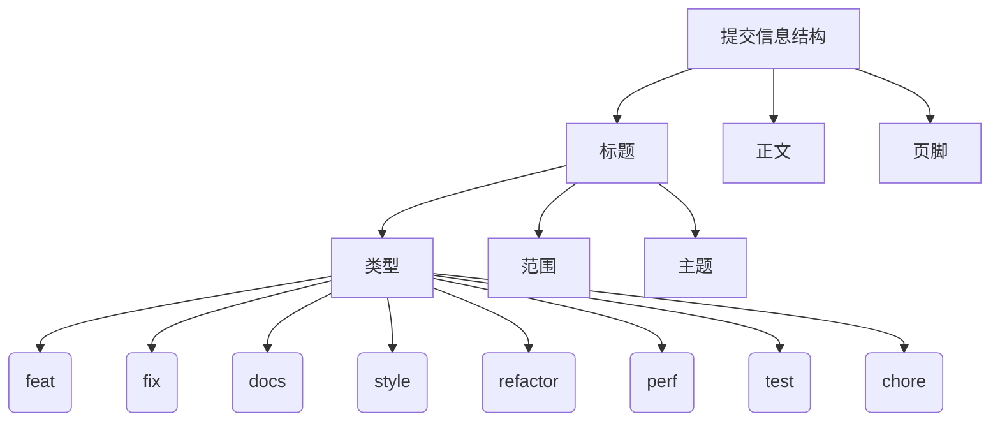

* content
{:toc}


该文记录 `Git` 提交规范。


# Git提交规范[^1]


## 1. 为什么需要

一份良好的 `commit` 记录的好处如下：

- 首行就是简洁实用的关键信息，方便在 git 历史中快速浏览
- 具有更加详细的 body 和 footer，可以清晰的看出某次提交的目的和影响
- 通过 type 可以快速过滤某些 commit（比如文档改动）
- 通过 commit 可以自动生成 Change log

### 1.1. 常见规范

1. [Angular commit convention](https://zj-git-guide.readthedocs.io/zh_CN/latest/message/Angular提交信息规范/)：Angular 项目的提交规范
2. [Conventional Commits](https://www.conventionalcommits.org/zh-hans/v1.0.0/)：约定式提交规范，基于 Angular 提交规范，提供了更加通用、简洁和灵活的提交规范。


## 2. 基本规范

每次提交，`Commit message` 都包括三个部分：`Header`，`Body` 和 `Footer`。

```
<type>(<scope>): <subject>
// 空一行
<body>
// 空一行
<footer>
```

其中，`Header` 是必需的，`Body` 和 `Footer` 可以省略。




## 3. Header

`Header` 部分只有一行，包括三个字段：`type`（必需）、`scope`（可选）和`subject`（必需）。

### 3.1. type 类型

| 类型     | 描述                   |
| :------- | :--------------------- |
| feat     | 新功能                 |
| fix      | 修复Bug                |
| docs     | 文档变更               |
| style    | 代码格式               |
| refactor | 代码重构               |
| perf     | 性能优化               |
| test     | 添加测试               |
| chore    | 构建过程或辅助工具变动 |
| revert   | 回滚版本               |

### 3.2. scope

`scope` 用于说明 `commit` 影响的范围，我们可以根据实际开发过程中的模块、功能或目录结构来定义 `scope`。

| scope 范围 | 说明               |
| :--------- | :----------------- |
| core       | 核心功能模块       |
| ui         | 用户界面           |
| network    | 网络相关模块       |
| database   | 数据库相关         |
| util       | 工具类、辅助函数   |
| config     | 配置文件           |
| build      | 构建脚本           |
| docs       | 文档               |
| test       | 测试               |
| ci         | 持续集成配置       |
| deps       | 第三方库或依赖管理 |
| logging    | 日志模块           |
| api        | API相关            |

### 3.3. subjetc

`subject`是 `commit` 目的的简短描述，不超过50个字符。


## 4. Body

`Body` 部分是对本次 `commit` 的详细描述，可以分成多行。

```
More detailed explanatory text, if necessary.  Wrap it to 
about 72 characters or so. 

Further paragraphs come after blank lines.

- Bullet points are okay, too
- Use a hanging indent
```


## 5. Footer

`Footer` 部分只用于两种情况

- 不兼容变动

如果当前代码与上一个版本不兼容，则 `Footer` 部分以 `BREAKING CHANGE` 开头，后面是对变动的描述、以及变动理由和迁移方法。

- 关闭 `Issue` 如果当前 `commit` 针对某个 `issue`，那么可以在 `Footer` 部分关闭这个 `issue`

```
Closes #123, #245, #992
```


## 6. 示例

**示例 1**：添加新功能

```
feat(auth): 添加用户登录功能

用户现在可以使用电子邮件和密码进行登录。
登录后用户可以访问个人主页。

Closes #123
```

**示例 2**：修复 Bug

```
fix(auth): 修复登录失败的 Bug

修复了由于密码字段为空导致的登录失败问题。
用户现在必须输入密码才能登录。

Closes #456
```

**示例 3**：文档变更

```
docs(readme): 更新 README 文件

增加了项目安装和使用说明。
添加了贡献指南和代码规范。

Relates #789
```

**示例 4**：代码格式变动

```
style(auth): 格式化登录模块代码

统一了代码风格，增加了注释。
修正了代码缩进和空行问题。
```

**示例 5**：代码重构

```
refactor(auth): 重构用户验证逻辑

将用户验证逻辑从控制器中提取到服务层。
优化了代码结构，提高了可维护性。
```

**示例 6**：性能优化

```
perf(auth): 优化登录性能

减少了数据库查询次数。
提升了用户登录速度。

Closes #987
```

**示例 7**：添加测试

```
test(auth): 添加登录功能单元测试

为用户登录功能添加了单元测试。
覆盖了各种边界情况和异常情况。

Closes #654
```

**示例 8**：构建过程变动

```
chore(build): 更新构建脚本

增加了自动化测试步骤。
优化了打包流程，减少了构建时间。
```


# 参考

[^1]: [git commit 提交规范](https://daotin.github.io/posts/2022/08/10/git-commit%E8%A7%84%E8%8C%83.html)
