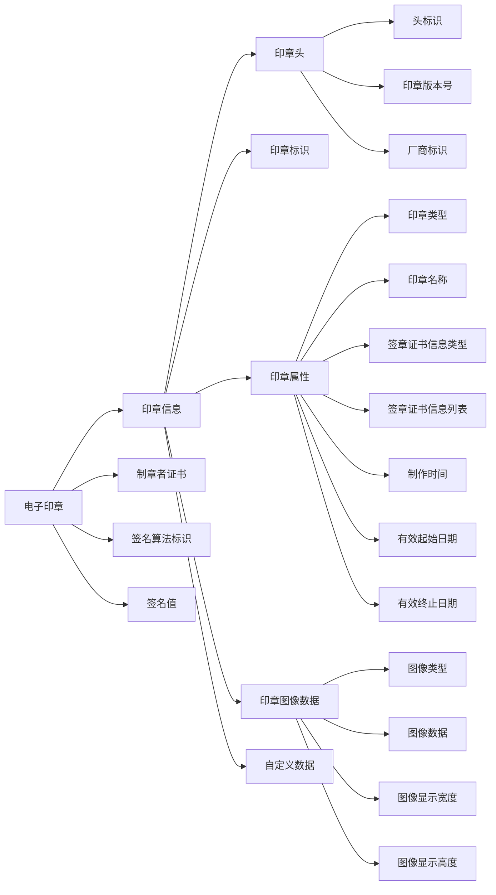
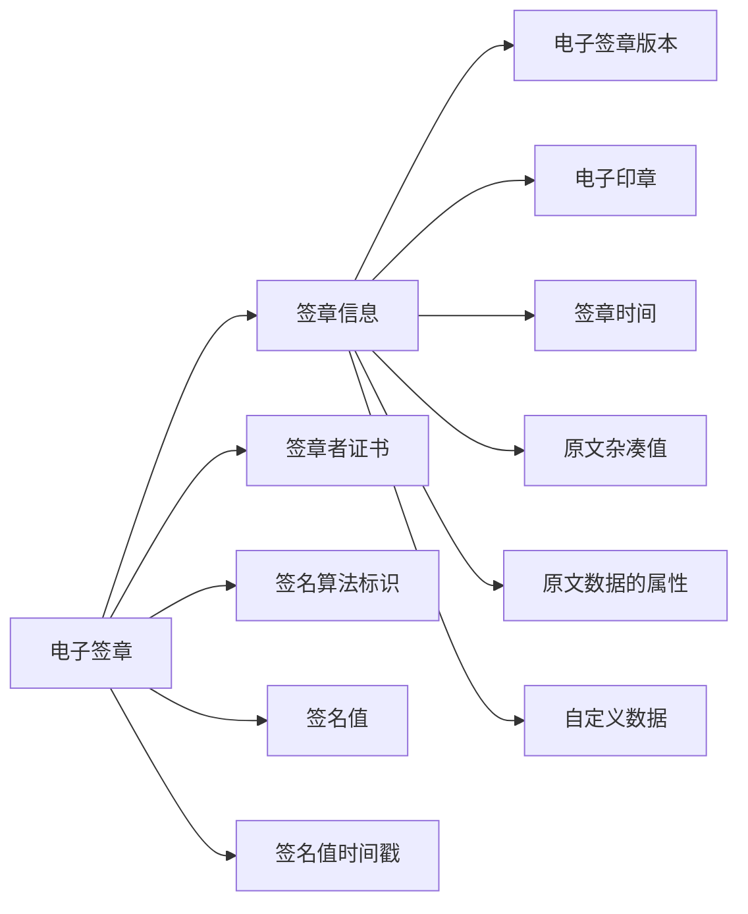
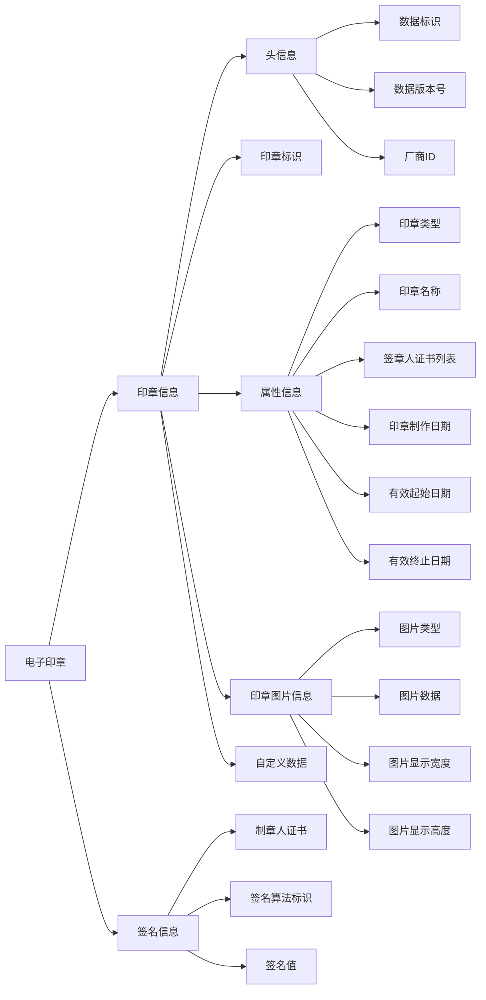
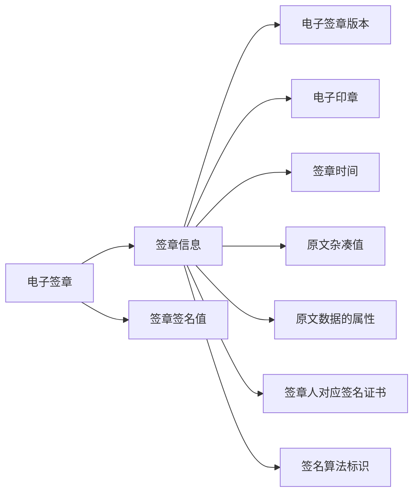

- [1. GB/T 38540](#1-gbt-38540)
  - [1.1. 电子印章](#11-电子印章)
  - [1.2. 电子签章](#12-电子签章)
- [2. GM/T 0031](#2-gmt-0031)
  - [2.1. 电子印章](#21-电子印章)
  - [2.2. 电子签章](#22-电子签章)
- [3. 分析](#3-分析)
  - [3.1. 电子印章](#31-电子印章)
  - [3.2 电子签章](#32-电子签章)
- [4. 代码实现](#4-代码实现)

该文记录对安全电子签章密码技术规范的理解。

# 安全电子签章密码技术规范

- GB/T 38540-2020 信息安全技术 安全电子签章密码技术规范
- GM/T 0031-2014 安全电子签章密码技术规范

## 1. GB/T 38540

### 1.1. 电子印章

### 1.2. 电子签章

## 2. GM/T 0031

### 2.1. 电子印章

### 2.2. 电子签章

## 3. 分析

### 3.1. 电子印章

可以看到 `GB/T 38540` 和 `GM/T 0031` 电子印章相关字段都是一样的，只是 `GB/T 38540` 的制章者证书，签名算法标识，签名值在外层，而 `GM/T 0031` 的制章者证书，签名算法标识，签名值在签名信息包裹。

为了区分两个标准的印章格式

- 如果可以把 `ASN1` 格式解析为树形图，可以简单判别子节点个数，有 4 个是 `GB/T 38540`  只有 2 个是 `GM/T 0031`
- 如果是依次解析，可以判断第一个节点后节点的类型，节点类型是 `OCTET_STRING(0x04)` 就是  `GB/T 38540` ，而节点类型是 `SEQUENCE` 就是 `GM/T 0031`

### 3.2 电子签章

可以看到 `GB/T 38540` 比 `GM/T 0031` 字段多了自定义数据、签名值时间戳，而且 `GB/T 38540` 的签章者证书和签名算法标识在外层。

为了区分两个标准的签章格式

- 如果可以把 `ASN1` 格式解析为树形图，可以简单判别子节点个数，有 5 个是 `GB/T 38540`  只有 2 个是 `GM/T 0031`
- 如果是依次解析，可以判断第一个节点后节点的类型，节点类型是 `OCTET_STRING(0x04)` 就是  `GB/T 38540` ，而节点类型是 `BIT_STRING(0x03)` 就是 `GM/T 0031`

## 4. 代码实现

https://github.com/august295/EnDeCode

# 参考
