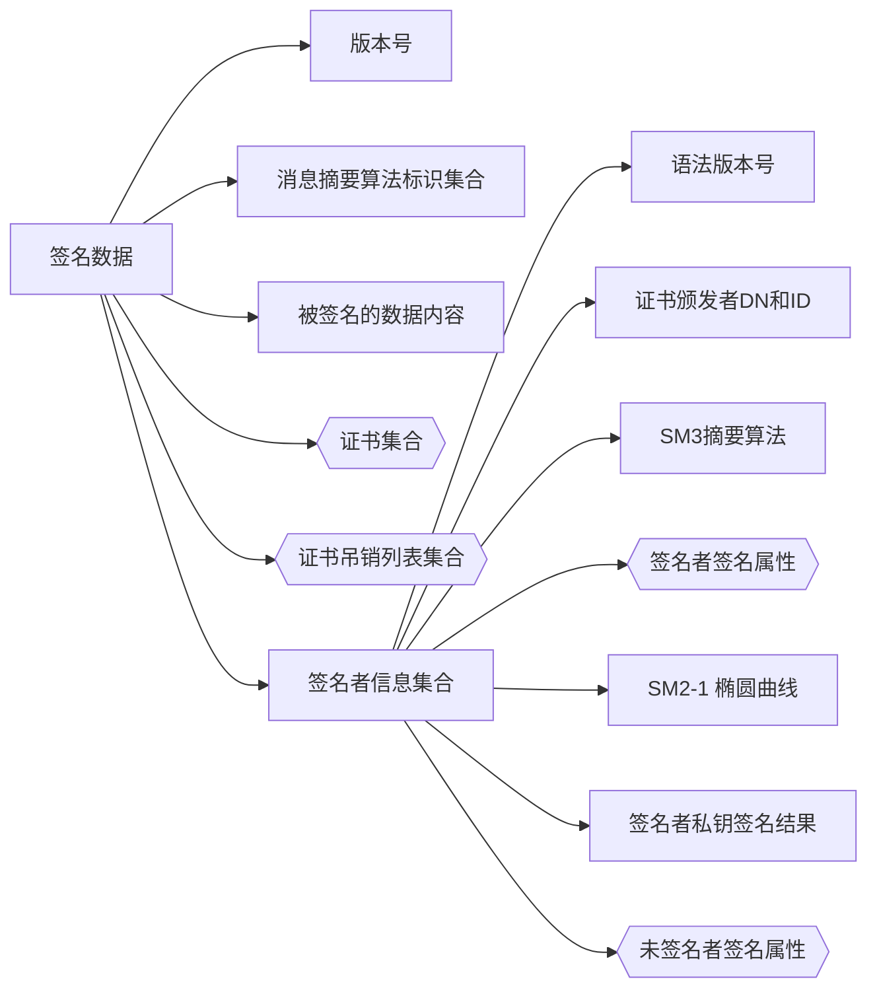
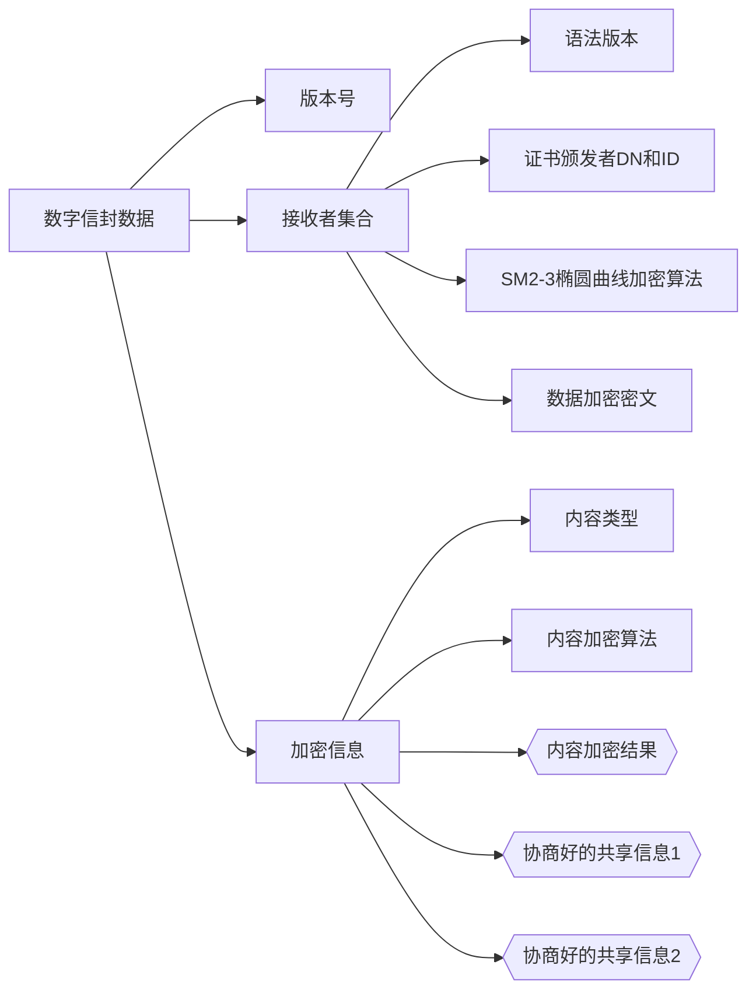
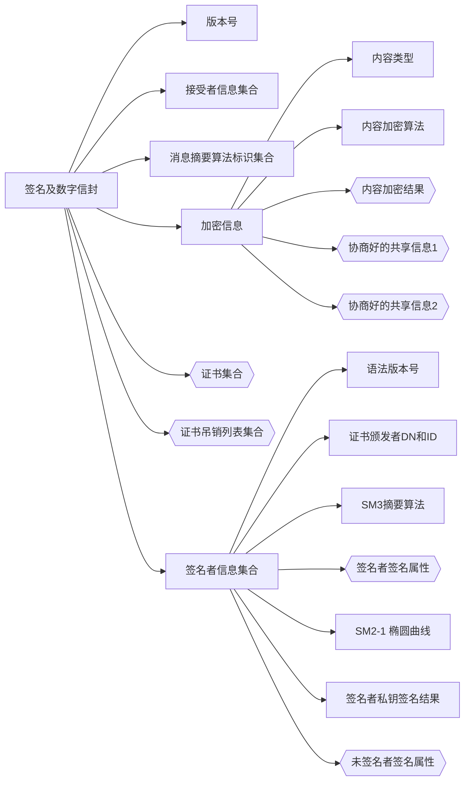
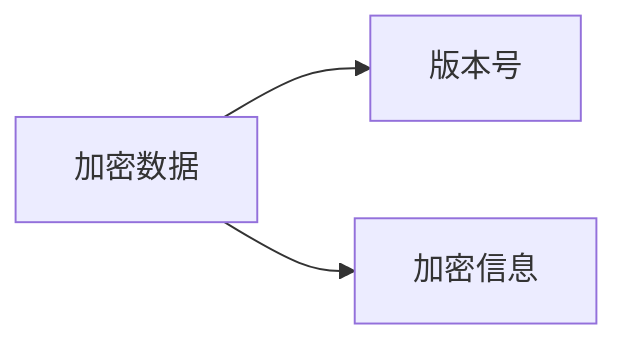
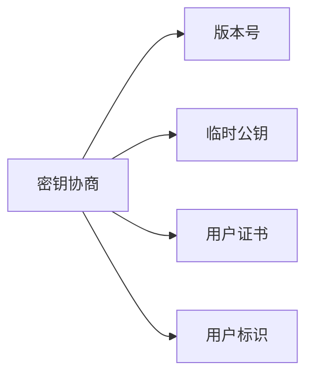

- [1. OID 定义](#1-oid-定义)
- [2. 类型定义](#2-类型定义)
  - [2.1. 内容交换通用语法结构](#21-内容交换通用语法结构)
- [3. 签名数据类型](#3-签名数据类型)
- [4. 数字信封数据类型](#4-数字信封数据类型)
- [5. 签名及数字信封数据类型](#5-签名及数字信封数据类型)
- [6. 加密数据类型](#6-加密数据类型)
- [7. 密钥协商类型](#7-密钥协商类型)
- [8. 代码实现](#8-代码实现)


该文记录对 `SM2` 密码算法加密签名消息语法规范的理解。


# SM2密码算法加密签名消息语法规范

- GM/T 0010-2012 SM2 密码算法加密签名消息语法规范

## 1. OID 定义

| 对象标识符 OID          | 对象标识符定义                                |
| ----------------------- | --------------------------------------------- |
| 1.2.156.10197.6.1.4.2   | SM2密码算法加密签名消息语法规范               |  |
| 1.2.156.10197.6.1.4.2.1 | 数据类型 data                                 |
| 1.2.156.10197.6.1.4.2.2 | 签名数据类型 signedData                       |
| 1.2.156.10197.6.1.4.2.3 | 数字信封数据类型 envelopedData                |
| 1.2.156.10197.6.1.4.2.4 | 签名及数字信封数据类型 signedAndEnvelopedData |
| 1.2.156.10197.6.1.4.2.5 | 加密数据类型 encryptedData                    |
| 1.2.156.10197.6.1.4.2.6 | 密钥协商类型 keyAgreementInfo                 |


## 2. 类型定义

### 2.1. 内容交换通用语法结构

```
ContentInfo ::= SEQUENCE {
    contentType ContentType,
    content[0] EXPLICIT ANY DEFINED BY contentType OPTIONAL
}
```

- `ContentType`: 是上述 `OID` 定义
- `content[0]`: 是下面类型数据


## 3. 签名数据类型



- 证书集合：可选
- 证书吊销列表集合：可选
- 签名者签名属性：可选
- 未签名者签名属性：可选


## 4. 数字信封数据类型



- 内容加密结果：可选
- 协商好的共享信息1：可选
- 协商好的共享信息2：可选


## 5. 签名及数字信封数据类型



同上


## 6. 加密数据类型




## 7. 密钥协商类型




## 8. 代码实现

https://github.com/august295/EnDeCode


# 参考
