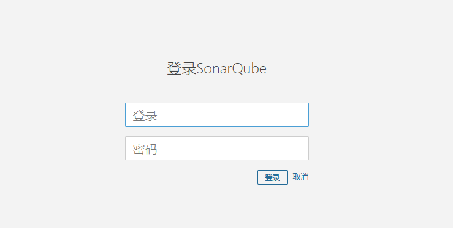
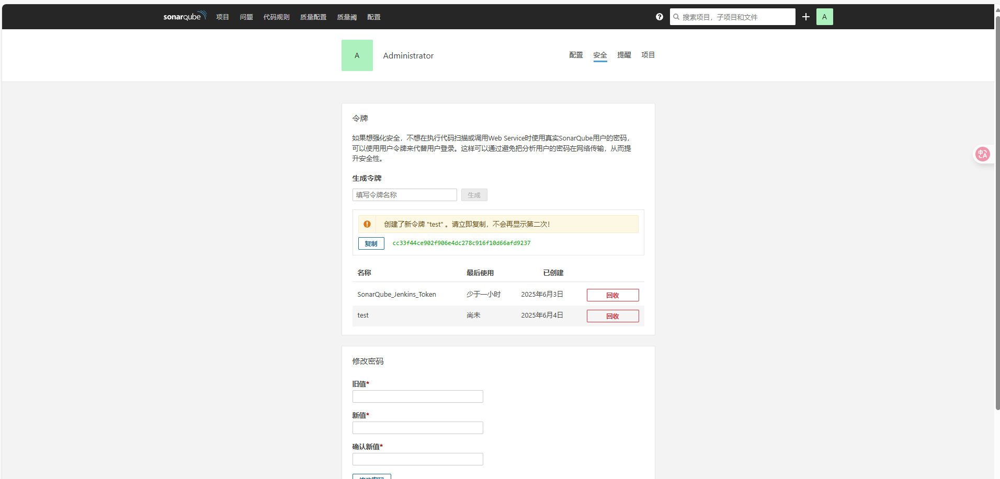
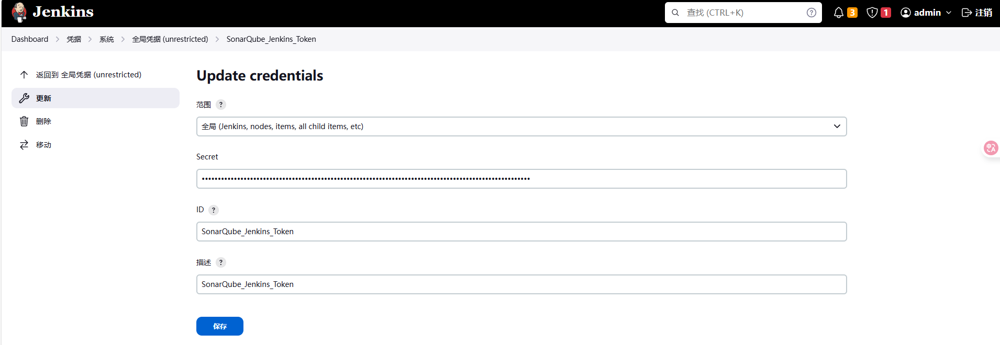
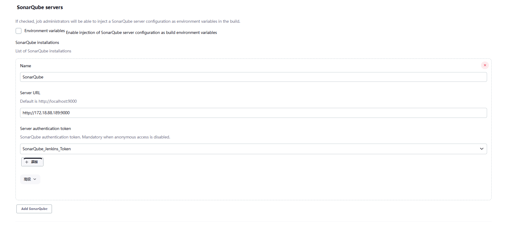
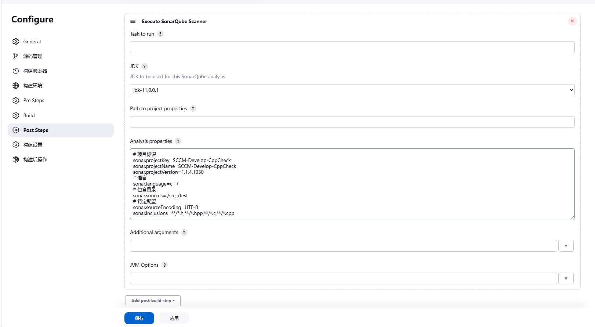
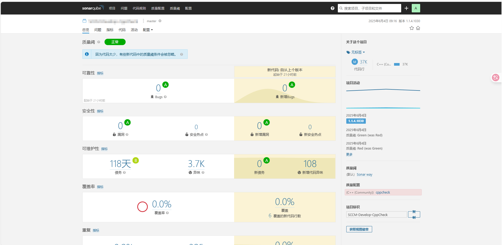
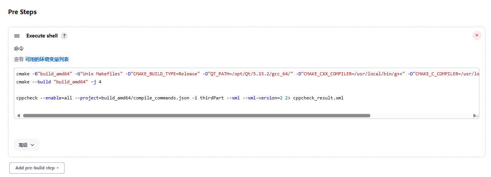
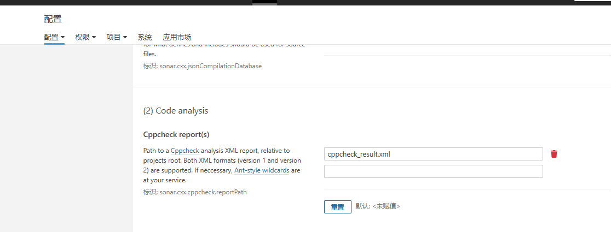

- [1. 环境](#1-环境)
- [2. 数据库](#2-数据库)
  - [2.1. 安装](#21-安装)
  - [2.2. 配置](#22-配置)
- [3. Java](#3-java)
- [4. sonarqube](#4-sonarqube)
  - [4.1. 参数配置](#41-参数配置)
  - [4.2. 启动](#42-启动)
  - [4.3. 访问](#43-访问)
  - [4.4. 使用](#44-使用)
    - [4.4.1. 插件安装](#441-插件安装)
    - [4.4.2. token配置](#442-token配置)
- [5. Jenkins](#5-jenkins)
  - [5.1. 插件管理](#51-插件管理)
  - [5.2. Sonar配置](#52-sonar配置)
  - [5.3. 项目配置](#53-项目配置)
- [6. CppCheck](#6-cppcheck)
  - [6.1. 什么时候使用](#61-什么时候使用)
  - [6.2. 使用](#62-使用)
    - [6.2.1. Jenkins项目配置](#621-jenkins项目配置)
    - [6.2.2. sonarqube配置](#622-sonarqube配置)


本文主要介绍 `Jenkins+Sonarqube+cppcheck` 怎么搭建一个静态检测和展示网址。


# Jenkins+Sonarqube+cppcheck 搭建


## 1. 环境

- CentOS7
- JDK11
- sonarqube7.8
- postgresql13


## 2. 数据库

### 2.1. 安装

| RPM 包名                                            | 作用                                                  |
| --------------------------------------------------- | ----------------------------------------------------- |
| `postgresql13-13.12-1PGDG.rhel7.x86_64.rpm`         | 客户端工具，例如 `psql`                               |
| `postgresql13-server-13.12-1PGDG.rhel7.x86_64.rpm`  | 数据库服务器（核心服务）                              |
| `postgresql13-libs-13.12-1PGDG.rhel7.x86_64.rpm`    | PostgreSQL 公共库，供客户端/服务端使用                |
| `postgresql13-contrib-13.12-1PGDG.rhel7.x86_64.rpm` | 可选的额外模块（如 uuid-ossp、pg_stat_statements 等） |

```shell
# 安装 postgresql
sudo yum install ./postgresql13-*.rpm
# 初始化数据库
sudo /usr/pgsql-13/bin/postgresql-13-setup initdb
# 启用服务
sudo systemctl enable postgresql-13
# 启动服务
sudo systemctl start postgresql-13
# 查看服务状态
sudo systemctl status postgresql-13
```

### 2.2. 配置

```shell
# 登录
psql -U postgres -h 127.0.0.1 -p 5432
# 创建用户 CREATE DATABASE [username]
CREATE DATABASE sonar;
# 设置密码 ALTER USER [username] WITH PASSWORD '[password]';
ALTER USER sonar WITH PASSWORD 'sonar';
# 创建数据库 CREATE DATABASE [database_name];
# 目前创建是属于 postgres，可以退出，用新用户登录再创建；或者创建后转移拥有者
CREATE DATABASE sonar;
# 转移仓库拥有者 ALTER DATABASE [database_name] OWNER TO [username];
ALTER DATABASE sonar OWNER TO sonar;
```

| 命令 | 含义           |
| ---- | -------------- |
| \q   | 退出           |
| \l   | 展示数据库列表 |
| \du  | 展示角色列表   |


## 3. Java

在环境变量中添加 `java` 相关配置即可。打开文件 `vim /etc/profile`

```shell
# Java
export JAVA_HOME=/usr/java/jdk-11.0.0.1
export JRE_HOME=$JAVA_HOME/
export CLASSPATH=.:$JAVA_HOME/lib/dt.jar:$JAVA_HOME/lib/tools.jar:$JRE_HOME/lib:$CLASSPATH
export PATH=$JAVA_HOME/bin:$PATH
```


## 4. sonarqube

```shell
# 解压
unzip sonarqube-7.8.zip -d /opt/
```

### 4.1. 参数配置

打开文件 `vim /opt/sonarqube-7.8/conf/sonar.properties`，写入以下配置

```shell
# 连接数据库，上述设置 postgresql 用户名，密码，仓库名
sonar.jdbc.username=sonar
sonar.jdbc.password=sonar
sonar.jdbc.url=jdbc:postgresql://127.0.0.1:5432/sonar
# web 堆栈大小
sonar.web.javaOpts=-Xmx2G -Xms1G -XX:+HeapDumpOnOutOfMemoryError
```

### 4.2. 启动

```shell
# 启动
/opt/sonarqube-7.8/bin/linux-x86-64/sonar.sh start
# 重启
/opt/sonarqube-7.8/bin/linux-x86-64/sonar.sh restart
```

<font color=red>sonarqube 必须以普通用户启动</font>

### 4.3. 访问

启动成功，就可以访问 `http://[ip]:9000` 进行登录，默认账号是 `admin`，密码是 `admin`。



### 4.4. 使用

#### 4.4.1. 插件安装

因为是使用 `C/C++` 开发，所以下载以下插件（C插件可以不要，可能会和C++包含文件规则冲突）

- sonar-l10n-zh-plugin-1.28.jar
- sonar-c-plugin-1.3.3.2051.jar
- sonar-cxx-plugin-1.3.3.2051.jar

将以上插件拷贝到 `/opt/sonarqube-7.8/extensions/plugins` 重启即可。

#### 4.4.2. token配置

因为 `Jenkins` 推荐使用 `token`，所以在 `sonarqube` 中创建一个 `token`，`cc33f44ce902f906e4dc278c916f10d66afd9237` 就是后面需要填写的数据




## 5. Jenkins

### 5.1. 插件管理

在 `manage plugins` 中搜索 `SonarQube Scanner` 并下载安装重启

### 5.2. Sonar配置

在 `Configure System` 中对 `SonarQube servers` 进行配置。

如果多个工程需要使用，可以在全局凭据中添加对应的配置，`Secret` 就是上述的 `token`，这样在其他地方使用这个凭据即可；或则在需要使用的地方添加上述的 `token`。





### 5.3. 项目配置

在一个代码检查的工程中，添加 `Execute SonarQube Scanner`，配置对应的 `jdk` 和 `sonarqube` 分析参数。



```
# 项目标识
sonar.projectKey=xxx-CppCheck
sonar.projectName=xxx-CppCheck
sonar.projectVersion=1.1.4.1030
# 语言
sonar.language=c++
# 包含目录
sonar.sources=./src,./test
# 特定配置
sonar.sourceEncoding=UTF-8
sonar.inclusions=**/*.h,**/*.hpp,**/*.c,**/*.cpp
```

所有配置完成，运行 `Jenkins` 工程，成功即可在 `sonarqube` 中查看检测报告




## 6. CppCheck

### 6.1. 什么时候使用

在使用 `sonarqube` 因为项目可能比较大，依赖的头文件比较多，导致 `sonarqube` 自带的文件分析并不能正确解析，手动添加头文件路径又比较多，所以采用 `cppcheck + cmake` 方式，能够自动查找对应的头文件。

### 6.2. 使用

系统安装 `cppcheck`。

#### 6.2.1. Jenkins项目配置



构建时添加 `CMAKE_EXPORT_COMPILE_COMMANDS=ON` 生成 `compile_commands.json` 构建文件，`cppcheck` 可以利用该文件查找依赖的头文件。

```shell
# cmake
cmake -B"build_amd64" -G"Unix Makefiles" -D"CMAKE_EXPORT_COMPILE_COMMANDS=ON"
# 如果不依赖中间生成文件，可以不编译（Qt moc 等是中间文件需要编译，不然查找不到）
cmake --build "build_amd64" -j 4
# cppcheck
cppcheck --enable=all --project=build_amd64/compile_commands.json -i thirdPart --xml --xml-version=2 2> cppcheck_result.xml
```

然后需要把 `sonarqube scan` 配置关闭检测，直接调用外部报告 `cppcheck_result.xml`

```
# 项目标识
sonar.projectKey=SCCM-Develop-CppCheck
sonar.projectName=SCCM-Develop-CppCheck
sonar.projectVersion=1.1.4.1030
# 语言
sonar.language=c++
# 包含目录
sonar.sources=./src,./test
# 特定配置
sonar.sourceEncoding=UTF-8
sonar.inclusions=**/*.h,**/*.hpp,**/*.c,**/*.cpp
# 关闭分析，使用外部报告
sonar.cxx.enabled=false
```

#### 6.2.2. sonarqube配置

在配置里面 `C++` 的 `Code analysis` 的 `Cppcheck report(s)` 添加使用 `cppcheck_result.xml`。



最后执行 `Jenkins` 工程也可以展示代码检测报告。


# 参考

[1] [Jenkins 集成 SonarQube Scanner - 废物大师兄 - 博客园](https://www.cnblogs.com/cjsblog/p/10740840.html)
