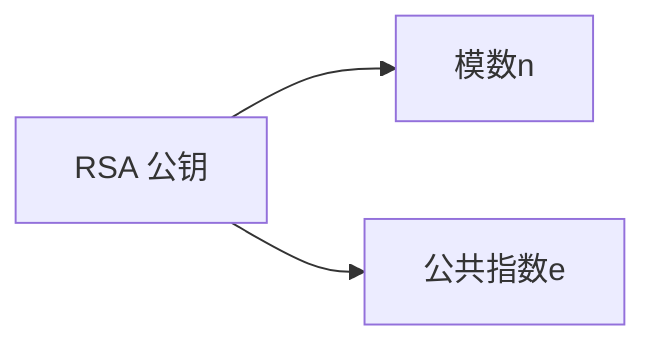
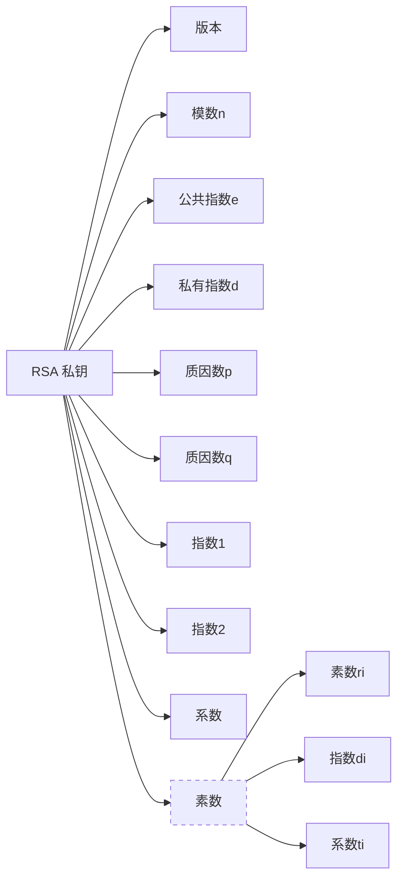

- [1. 简介](#1-简介)
- [2. 语法](#2-语法)
  - [2.1. RSA 密钥](#21-rsa-密钥)
    - [2.1.1. RSA 公钥](#211-rsa-公钥)
    - [2.1.2. RSA 私钥](#212-rsa-私钥)
- [3. OID](#3-oid)


该文主要介绍 `PKCS1` 即 `RSA` 加密。


# PKCS1RSA加密[^1]


## 1. 简介

PKCS #1(RSA Cryptography): 基于 `RSA` 算法的公钥密码学的实现提供以下建议

- Cryptographic primitives: 
- Encryption schemes: 加密方案
- Signature schemes with appendix: 附录签名方案
- ASN.1 syntax for representing keys and for identifying the schemes: 用于表示键和标识方案的 `ASN.1` 语法


## 2. 语法

### 2.1. RSA 密钥

```ASN.1
rsaEncryption    OBJECT IDENTIFIER ::= { pkcs-1 1 }
```

#### 2.1.1. RSA 公钥

```ASN.1
RSAPublicKey ::= SEQUENCE {
    modulus           INTEGER,  -- n
    publicExponent    INTEGER   -- e
}
```



#### 2.1.2. RSA 私钥

```ASN.1
RSAPrivateKey ::= SEQUENCE {
    version           Version,
    modulus           INTEGER,  -- n
    publicExponent    INTEGER,  -- e
    privateExponent   INTEGER,  -- d
    prime1            INTEGER,  -- p
    prime2            INTEGER,  -- q
    exponent1         INTEGER,  -- d mod (p-1)
    exponent2         INTEGER,  -- d mod (q-1)
    coefficient       INTEGER,  -- (inverse of q) mod p
    otherPrimeInfos   OtherPrimeInfos OPTIONAL
}
```



## 3. OID

| OID                     | 名称 (Short Name)         | 描述                                                                |
| :---------------------- | :------------------------ | :------------------------------------------------------------------ |
| `1.2.840.113549.1.1.1`  | `rsaEncryption`           | 最基础的 RSA 算法 OID。                                             |
| `1.2.840.113549.1.1.2`  | `md2WithRSAEncryption`    | 使用 MD2 哈希算法进行哈希，然后进行 RSA 加密的签名算法。            |
| `1.2.840.113549.1.1.3`  | `md4WithRSAEncryption`    | 使用 MD4 哈希算法进行哈希，然后进行 RSA 加密的签名算法。            |
| `1.2.840.113549.1.1.4`  | `md5WithRSAEncryption`    | 使用 MD5 哈希算法进行哈希，然后进行 RSA 加密的签名算法。            |
| `1.2.840.113549.1.1.5`  | `sha1WithRSAEncryption`   | 使用 SHA-1 哈希算法进行哈希，然后进行 RSA 加密的签名算法。          |
| `1.2.840.113549.1.1.6`  |                           | 保留用于 RSA 的 OAEP 加密方案。                                     |
| `1.2.840.113549.1.1.7`  | `rsaesOaep`               | 标识 RSAES-OAEP 加密方案。                                          |
| `1.2.840.113549.1.1.8`  | `mgf1`                    | 标识 MGF1 (Mask Generation Function #1)。                           |
| `1.2.840.113549.1.1.9`  | `pSpecified`              | 标识在 RSAES-OAEP 中编码参数 `P` (Label) 的空字符串或特定编码方式。 |
| `1.2.840.113549.1.1.10` | `rsassaPss`               | 标识 RSASSA-PSS 签名方案。                                          |
| `1.2.840.113549.1.1.11` | `sha256WithRSAEncryption` | 使用 SHA-256 哈希算法进行哈希，然后进行 RSA 加密的签名算法。        |
| `1.2.840.113549.1.1.12` | `sha384WithRSAEncryption` | 使用 SHA-384 哈希算法进行哈希，然后进行 RSA 加密的签名算法。        |
| `1.2.840.113549.1.1.13` | `sha512WithRSAEncryption` | 使用 SHA-512 哈希算法进行哈希，然后进行 RSA 加密的签名算法。        |
| `1.2.840.113549.1.1.14` | `sha224WithRSAEncryption` | 使用 SHA-224 哈希算法进行哈希，然后进行 RSA 加密的签名算法。        |


# 参考

[^1]: [RFC 3447 - Public-Key Cryptography Standards (PKCS) #1: RSA Cryptography Specifications Version 2.1](https://datatracker.ietf.org/doc/html/rfc3447)

