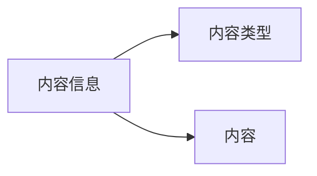
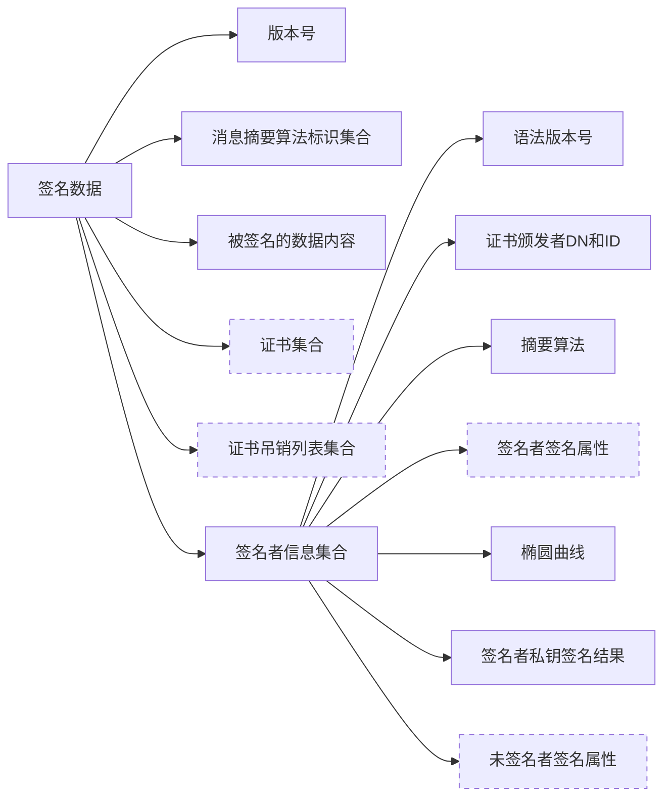
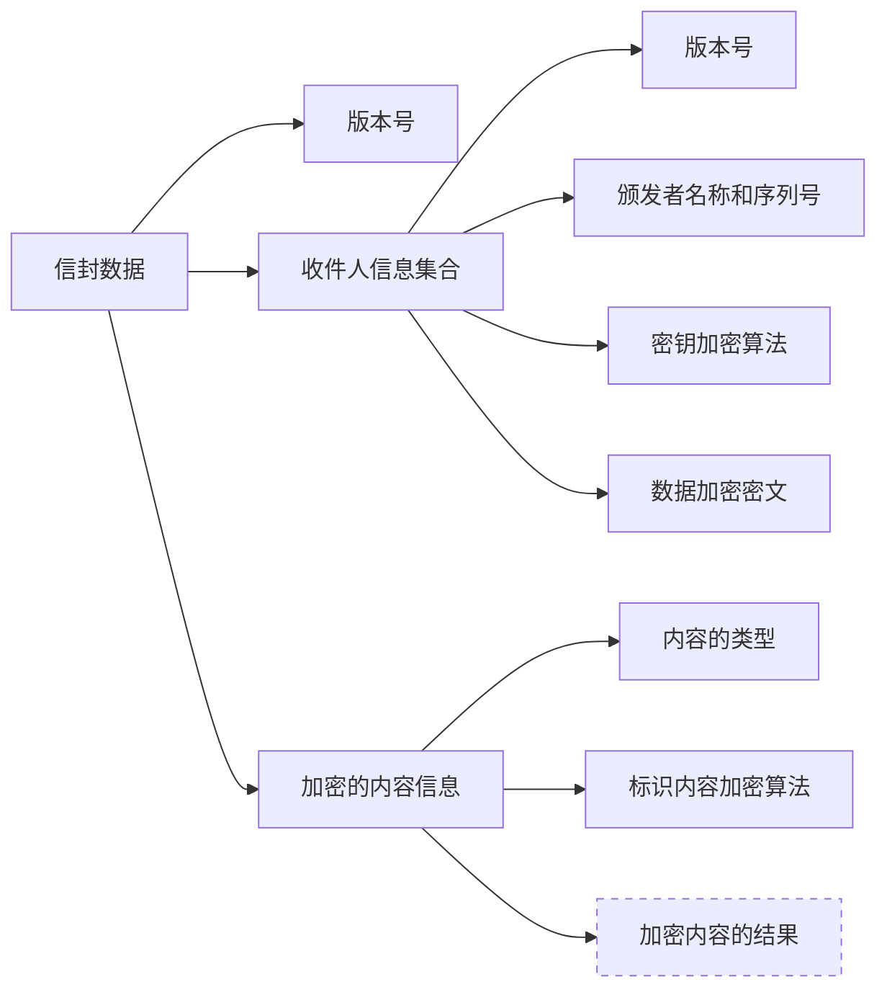
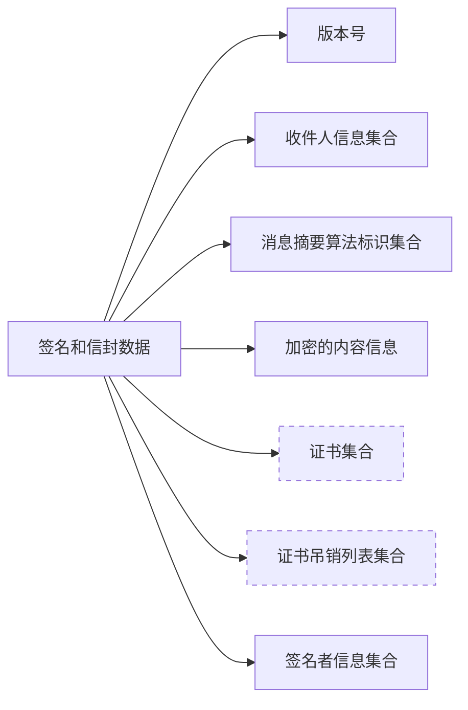
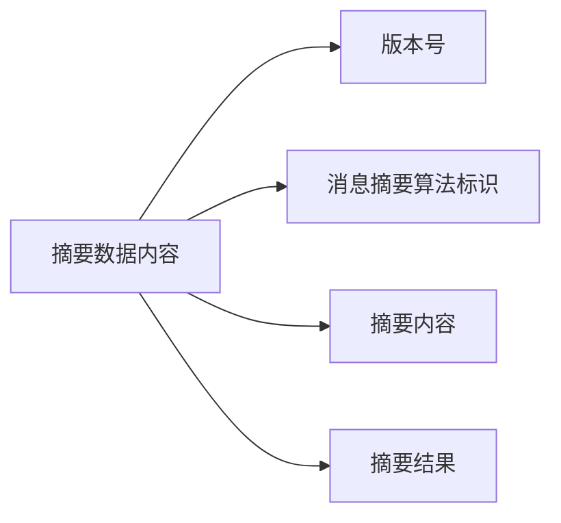
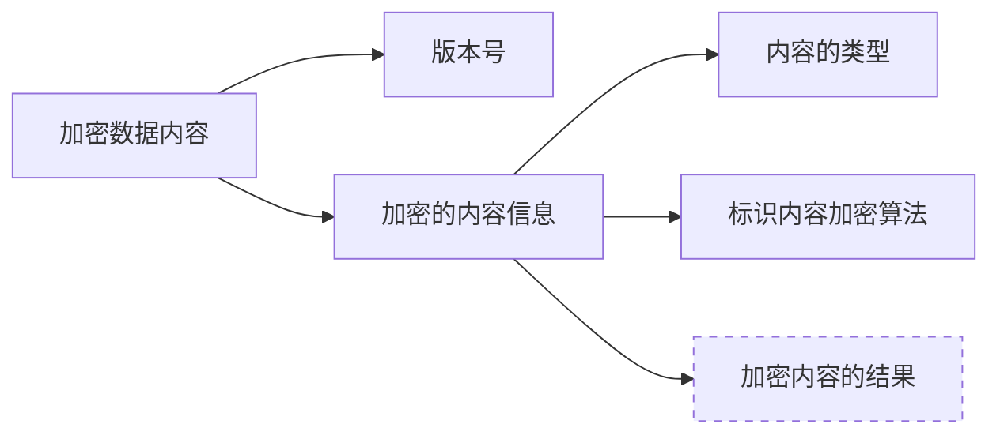

- [1. 简介](#1-简介)
- [2. 定义](#2-定义)
- [3. 语法](#3-语法)
  - [3.1. 通用语法](#31-通用语法)
  - [3.2. 数据内容类型](#32-数据内容类型)
  - [3.3. 签名数据内容类型](#33-签名数据内容类型)
  - [3.4. 信封数据内容类型](#34-信封数据内容类型)
  - [3.5. 签名和信封数据类型](#35-签名和信封数据类型)
  - [3.6. 摘要数据内容类型](#36-摘要数据内容类型)
  - [3.7. 加密数据内容类型](#37-加密数据内容类型)
- [4. OID](#4-oid)


该文主要介绍 `PKCS7` 即加密消息语法。


# PKCS7加密消息语法[^1]


## 1. 简介

PKCS #7(Cryptographic Message Syntax)

本文档介绍可能应用了加密技术的数据（如数字签名和数字信封）的常规语法。该语法允许递归，因此，例如，一个信封可以嵌套在另一个信封中，或者一方可以对一些以前信封的数字数据进行签名。它还允许对任意属性（如签名时间）与消息内容一起进行身份验证，并提供与签名关联的其他属性（如会签）。语法的退化情况提供了一种传播证书和证书吊销列表的方法。


## 2. 定义

- ASN.1(Abstract Syntax Notation One): 抽象语法表示法一
- BER(Basic Encoding Rules): 基本编码规则，如 `X.209` 中定义。
- DER(Distinguished Encoding Rules): `ASN.1` 的可分编码规则，如 `X.509` 中所定义。
- PEM(Internet Privacy-Enhanced Mail): 互联网隐私增强型邮件，定义见 `RFC 1421-1424`。


## 3. 语法

### 3.1. 通用语法

通用语法(General syntax): 实体之间交换的内容的常规语法将内容类型与内容相关联。

```ASN.1
ContentInfo ::= SEQUENCE {
    contentType ContentType,
    content     [0] EXPLICIT ANY DEFINED BY contentType OPTIONAL
}

ContentType ::= OBJECT IDENTIFIER
```



- `ContentType`: 是 `OID` 定义
- `content[0]`: 是下面类型数据

### 3.2. 数据内容类型

数据内容类型(Data content type): 数据内容类型只是一个八位字节字符串。

```ASN.1
Data ::= OCTET STRING
```

### 3.3. 签名数据内容类型

签名数据内容类型(Signed-data content type): 签名数据内容类型由任何类型的内容和零个或多个签名者的内容的加密消息摘要组成。签名者的加密摘要是该签名者内容上的“数字签名”。任何类型的内容都可以由任意数量的签名者并行签名。此外，语法具有退化情况，其中内容上没有签名者。退化案例提供了一种传播证书和证书吊销列表的方法。

```ASN.1
SignedData ::= SEQUENCE {
    version             Version,
    digestAlgorithms    DigestAlgorithmIdentifiers,
    contentInfo         ContentInfo,
    certificates        [0] IMPLICIT ExtendedCertificatesAndCertificates OPTIONAL,
    crls                [1] IMPLICIT CertificateRevocationLists OPTIONAL,
    signerInfos         SignerInfos 
}

DigestAlgorithmIdentifiers ::= SET OF DigestAlgorithmIdentifier

SignerInfos ::= SET OF SignerInfo

SignerInfo ::= SEQUENCE {
    version                     Version,
    issuerAndSerialNumber       IssuerAndSerialNumber,
    digestAlgorithm             DigestAlgorithmIdentifier,
    authenticatedAttributes     [0] IMPLICIT Attributes OPTIONAL,
    digestEncryptionAlgorithm   DigestEncryptionAlgorithmIdentifier,
    encryptedDigest             EncryptedDigest,
    unauthenticatedAttributes   [1] IMPLICIT Attributes OPTIONAL 
}

EncryptedDigest ::= OCTET STRING
```



### 3.4. 信封数据内容类型

信封数据内容类型(Enveloped-data content type): 信封数据内容类型由任何类型的加密内容和一个或多个收件人的加密内容加密密钥组成。收件人的加密内容和加密内容加密密钥的组合是该收件人的“数字信封”。任何类型的内容都可以并行为任意数量的收件人进行信封。

```ASN.1
EnvelopedData ::= SEQUENCE {
    version                 Version,
    recipientInfos          RecipientInfos,
    encryptedContentInfo    EncryptedContentInfo
}

RecipientInfos ::= SET OF RecipientInfo

RecipientInfo ::= SEQUENCE {
    version                 Version,
    issuerAndSerialNumber   IssuerAndSerialNumber,
    keyEncryptionAlgorithm  KeyEncryptionAlgorithmIdentifier,
    encryptedKey            EncryptedKey
}

EncryptedKey ::= OCTET STRING

EncryptedContentInfo ::= SEQUENCE {
    contentType                 ContentType,
    contentEncryptionAlgorithm  ContentEncryptionAlgorithmIdentifier,
    encryptedContent            [0] IMPLICIT EncryptedContent OPTIONAL
}

EncryptedContent ::= OCTET STRING
```



### 3.5. 签名和信封数据类型

签名和信封数据类型(SignedAndEnvelopedData type)

```ASN.1
SignedAndEnvelopedData ::= SEQUENCE {
    version                 Version,
    recipientInfos          RecipientInfos,
    digestAlgorithms        DigestAlgorithmIdentifiers,
    encryptedContentInfo    EncryptedContentInfo
    certificates            [0] IMPLICIT ExtendedCertificatesAndCertificates OPTIONAL,
    crls                    [1] IMPLICIT CertificateRevocationLists OPTIONAL,
    signerInfos             SignerInfos 
}
```



### 3.6. 摘要数据内容类型

摘要数据内容类型(Digested-data content type): 摘要数据内容类型由任何类型的内容和内容的消息摘要组成。

```ASN.1
DigestedData ::= SEQUENCE {
    version         Version,
    digestAlgorithm DigestAlgorithmIdentifier,
    contentInfo     ContentInfo,
    digest          Digest
}

Digest ::= OCTET STRING
```



### 3.7. 加密数据内容类型

加密数据内容类型(Encrypted-data content type): 加密数据内容类型由任何类型的加密内容组成。与信封数据内容类型不同，加密数据内容类型既没有收件人，也没有加密的内容加密密钥。假定密钥通过其他方式进行管理。

```ASN.1
EncryptedData ::= SEQUENCE {
    version Version,
    encryptedContentInfo EncryptedContentInfo
}
```




## 4. OID

| OID                    | 名称                     | 描述                                     |
| :--------------------- | :----------------------- | :--------------------------------------- |
| `1.2.840.113549.1.7.1` | `data`                   | 标识内容为原始的、未受保护的二进制数据。 |
| `1.2.840.113549.1.7.2` | `signedData`             | 标识内容为一个数字签名结构。             |
| `1.2.840.113549.1.7.3` | `envelopedData`          | 标识内容为一个数字信封。                 |
| `1.2.840.113549.1.7.4` | `signedAndEnvelopedData` | 同时提供签名和加密的结构。               |
| `1.2.840.113549.1.7.5` | `digestedData`           | 标识内容为一个摘要结构。                 |
| `1.2.840.113549.1.7.6` | `encryptedData`          | 标识内容为使用对称密钥加密的数据。       |


# 参考

[^1]: [RFC 2315 - PKCS #7: Cryptographic Message Syntax Version 1.5](https://datatracker.ietf.org/doc/html/rfc2315)
