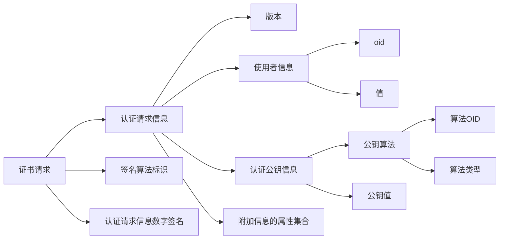

- [1. 简介](#1-简介)
- [2. 定义](#2-定义)
- [3. 语法](#3-语法)
  - [3.1. 签名](#31-签名)


该文主要介绍 `PKCS10` 即证书请求语法。


# PKCS10证书请求语法[^1]


## 1. 简介

PKCS #10(Certification Request Syntax Specification)

本文档描述了认证请求的语法。认证请求由可分辨名称、公钥和可选的一组属性组成，这些属性由请求认证的实体共同签名。证书请求被发送到证书颁发机构，该机构将请求转换为 `X.509` 公钥证书。


## 2. 定义

- Name: 唯一标识或区分 `X.500` 目录中对象的类型。此类型在 `X.501` 中定义。在 `X.509` 证书中，类型标识证书颁发者和证书使用者（公钥经过认证的实体）。


## 3. 语法

证书请求由三部分组成：认证请求信息、签名算法标识符和认证请求信息上的数字签名。认证请求信息由实体的可分辨名称、实体的公钥和一组提供有关实体的其他信息的属性组成。

```ASN.1
CertificationRequest ::= SEQUENCE {
    certificationRequestInfo    CertificationRequestInfo,
    signatureAlgorithm          AlgorithmIdentifier{{ SignatureAlgorithms }},
    signature                   BIT STRING
}

CertificationRequestInfo ::= SEQUENCE {
    version       INTEGER { v1(0) } (v1,...),
    subject       Name,
    subjectPKInfo SubjectPublicKeyInfo{{ PKInfoAlgorithms }},
    attributes    [0] Attributes{{ CRIAttributes }}
}

SubjectPublicKeyInfo ::= SEQUENCE {
    algorithm        AlgorithmIdentifier {{IOSet}},
    subjectPublicKey BIT STRING
}

Attribute ::= SEQUENCE {
    type   ATTRIBUTE.&id({IOSet}),
    values SET SIZE(1..MAX) OF ATTRIBUTE.&Type({IOSet}{@type})
}

AlgorithmIdentifier ::= SEQUENCE {
    algorithm          ALGORITHM.&id({IOSet}),
    parameters         ALGORITHM.&Type({IOSet}{@algorithm}) OPTIONAL
}
```




- 使用者信息是集合

### 3.1. 签名

签名过程包括两个步骤

1. 认证请求信息经过 `DER` 编码，产生一个八位字节字符串。
2. 在指定的签名算法下，使用认证请求主体的私钥对步骤1的结果进行签名，生成一个位字符串，即签名。


# 参考

[^1]: [RFC 2986 - PKCS #10: Certification Request Syntax Specification Version 1.7](https://datatracker.ietf.org/doc/html/rfc2986)

