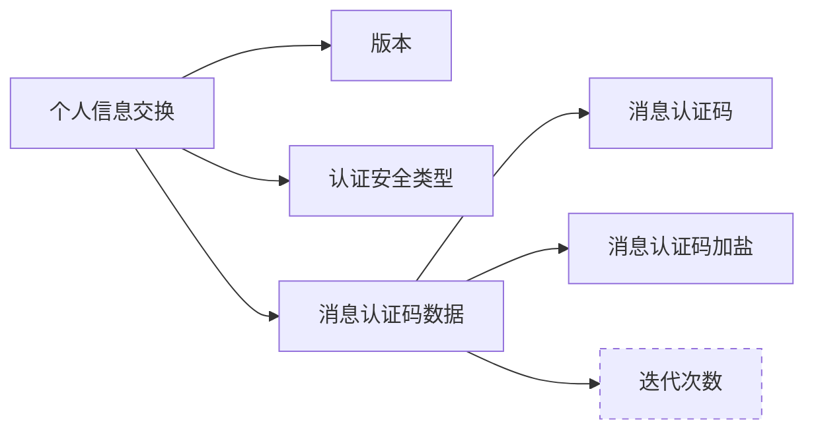
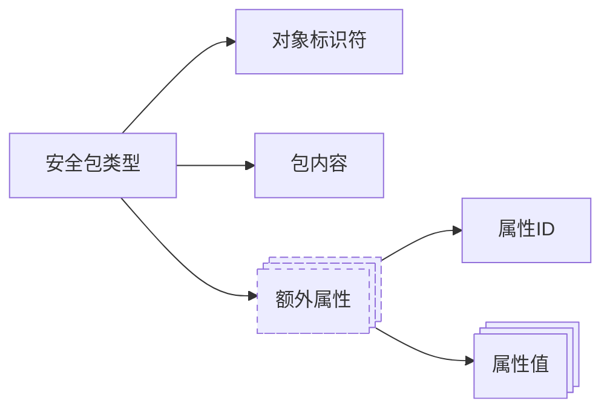
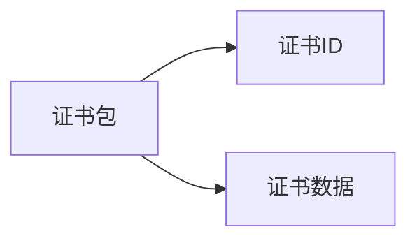
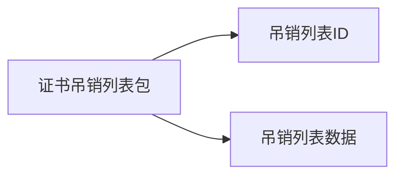

- [1. 简介](#1-简介)
- [2. 定义](#2-定义)
- [3. PFX PDU 语法](#3-pfx-pdu-语法)
  - [3.1. The AuthenticatedSafe Type](#31-the-authenticatedsafe-type)
  - [3.2. The SafeBag Type](#32-the-safebag-type)
    - [3.2.1. The KeyBag Type](#321-the-keybag-type)
    - [3.2.2. The PKCS8ShroudedKeyBag Type](#322-the-pkcs8shroudedkeybag-type)
    - [3.2.3. The CertBag Type](#323-the-certbag-type)
    - [3.2.4. The CRLBag Type](#324-the-crlbag-type)
    - [3.2.5. The SecretBag Type](#325-the-secretbag-type)
    - [3.2.6. The SafeContents Type](#326-the-safecontents-type)
- [4. OID](#4-oid)


该文主要介绍 `PKCS12` 即个人信息交换语法。


# PKCS12个人信息交换语法[^1]


## 1. 简介

PKCS #12(Personal Information Exchange Syntax)

该标准描述了个人身份信息的传输语法，包括私钥、证书、杂项密钥和扩展名。支持此标准的计算机、应用程序、浏览器、`Internet` 信息亭等将允许用户导入、导出和行使一组个人身份信息。

该标准支持在多种隐私和完整性模式下直接传输个人信息。最安全的隐私和完整性模式要求源平台和目标平台具有可分别用于数字签名和加密的受信任公钥/私钥对。该标准还支持较低安全性、基于密码的隐私和完整性模式，适用于不受信任的公钥/私钥对不可用的情况。

该标准可以被视为建立在 `PKCS #8` 的基础上，包括基本但辅助的身份信息以及私钥，并通过公钥隐私和完整性模式建立了更高的安全性。


## 2. 定义

- PDU(Protocol Data Unit): 协议数据单元，以独立于机器的格式构成协议中消息的位序列。
- PFX(Personal Information Exchange): 该标准中定义的顶级交换 `PDU`。


## 3. PFX PDU 语法

```ASN.1
PFX ::= SEQUENCE {
    version     INTEGER {v3(3)}(v3,...),
    authSafe    ContentInfo,
    macData     MacData OPTIONAL
}

MacData ::= SEQUENCE {
    mac         DigestInfo,
    macSalt     OCTET STRING,
    iterations  INTEGER DEFAULT 1
    -- Note: The default is for historical reasons and its
    --       use is deprecated.
}
```



### 3.1. The AuthenticatedSafe Type

`AuthenticatedSafe` 包含一系列 `ContentInfo` 值。这些 `ContentInfo` 值的内容字段包含明文、加密或封装数据。

```ASN.1
AuthenticatedSafe ::= SEQUENCE OF ContentInfo
    -- Data if unencrypted
    -- EncryptedData if password-encrypted
    -- EnvelopedData if public key-encrypted
```

### 3.2. The SafeBag Type

```ASN.1
SafeContents ::= SEQUENCE OF SafeBag

SafeBag ::= SEQUENCE {
    bagId          BAG-TYPE.&id ({PKCS12BagSet})
    bagValue       [0] EXPLICIT BAG-TYPE.&Type({PKCS12BagSet}{@bagId}),
    bagAttributes  SET OF PKCS12Attribute OPTIONAL
}

PKCS12Attribute ::= SEQUENCE {
    attrId      ATTRIBUTE.&id ({PKCS12AttrSet}),
    attrValues  SET OF ATTRIBUTE.&Type ({PKCS12AttrSet}{@attrId})
} -- This type is compatible with the X.500 type 'Attribute'

PKCS12AttrSet ATTRIBUTE ::= {
    friendlyName | -- from PKCS #9
    localKeyId,    -- from PKCS #9
    ... -- Other attributes are allowed
}
```



#### 3.2.1. The KeyBag Type

钥匙袋是 `PKCS#8 PrivateKeyInfo`。请注意，KeyBag 只包含一个私钥。

```ASN.1
KeyBag ::= PrivateKeyInfo
```

#### 3.2.2. The PKCS8ShroudedKeyBag Type

`PKCS8CovertedKeyBag` 持有私钥，私钥已根据 `PKCS#8` 进行了保护。请注意，`PKCS8CovertedKeyBag` 仅持有一个 `Coverted` 私钥。

```ASN.1
PKCS8ShroudedKeyBag ::= EncryptedPrivateKeyInfo
```

#### 3.2.3. The CertBag Type

`CertBag` 包含某种类型的证书。对象标识符用于区分不同的证书类型。

```ASN.1
CertBag ::= SEQUENCE {
    certId      BAG-TYPE.&id   ({CertTypes}),
    certValue   [0] EXPLICIT BAG-TYPE.&Type ({CertTypes}{@certId})
}

x509Certificate BAG-TYPE ::=
    {OCTET STRING IDENTIFIED BY {certTypes 1}}
    -- DER-encoded X.509 certificate stored in OCTET STRING
sdsiCertificate BAG-TYPE ::=
    {IA5String IDENTIFIED BY {certTypes 2}}
    -- Base64-encoded SDSI certificate stored in IA5String

CertTypes BAG-TYPE ::= {
    x509Certificate |
    sdsiCertificate,
    ... -- For future extensions
}
```



#### 3.2.4. The CRLBag Type

`CRLBag` 包含特定类型的证书吊销列表（CRL）。对象标识符用于区分不同的 `CRL` 类型。

```ASN.1
CRLBag ::= SEQUENCE {
    crlId      BAG-TYPE.&id  ({CRLTypes}),
    crlValue  [0] EXPLICIT BAG-TYPE.&Type ({CRLTypes}{@crlId})
}

x509CRL BAG-TYPE ::=
    {OCTET STRING IDENTIFIED BY {crlTypes 1}}
    -- DER-encoded X.509 CRL stored in OCTET STRING

CRLTypes BAG-TYPE ::= {
    x509CRL,
    ... -- For future extensions
}
```



#### 3.2.5. The SecretBag Type

```ASN.1
SecretBag ::= SEQUENCE {
    secretTypeId   BAG-TYPE.&id ({SecretTypes}),
    secretValue    [0] EXPLICIT BAG-TYPE.&Type ({SecretTypes} {@secretTypeId})
}

SecretTypes BAG-TYPE ::= {
    ... -- For future extensions
}
```

#### 3.2.6. The SafeContents Type

第六种可以放在安全袋中的袋子是安全内容物。这种递归结构允许在顶级安全内容中任意嵌套多个`keyBag`、`PKCS8CovertedKeyBags`、`CertBags`、`CRLBAG`和`SecretBags`。

## 4. OID

| OID                          | 名称/类别             | 描述                                                        |
| :--------------------------- | :-------------------- | :---------------------------------------------------------- |
| `1.2.840.113549.1.12`        | `pkcs-12`             | PKCS#12 标准的根 OID。                                      |
| `1.2.840.113549.1.12.10`     | `bagtypes`            | 袋子类型的集合。这是 PKCS#12 文件内部存储对象的类型标识符。 |
| `1.2.840.113549.1.12.10.1.1` | `keyBag`              | 袋子包含一个未加密的私钥。                                  |
| `1.2.840.113549.1.12.10.1.2` | `pkcs8ShroudedKeyBag` | 袋子包含一个加密的私钥。这是最常见的形式。                  |
| `1.2.840.113549.1.12.10.1.3` | `certBag`             | 袋子包含一个证书（通常是 X.509）。                          |
| `1.2.840.113549.1.12.10.1.4` | `crlBag`              | 袋子包含一个证书吊销列表 (CRL)。                            |
| `1.2.840.113549.1.12.10.1.5` | `secretBag`           | 袋子包含一个对称密钥（秘密密钥）。                          |
| `1.2.840.113549.1.12.10.1.6` | `safeContentsBag`     | 袋子包含另一个 `SafeContents`，用于嵌套结构。               |


# 参考

[^1]: [RFC 7292 - PKCS #12: Personal Information Exchange Syntax v1.1](https://datatracker.ietf.org/doc/html/rfc7292)

